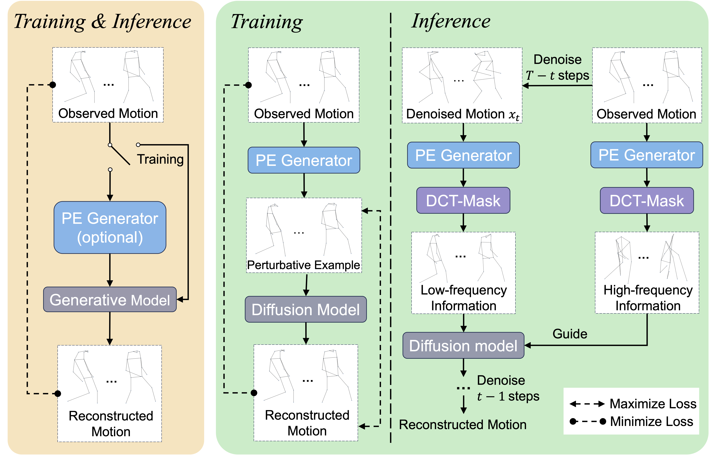

<h1 align="center"><strong>FGDMAD: Frequency-Guided Diffusion Model with Perturbation Training for Skeleton-Based Video Anomaly Detection</strong></h1>

<p align="center">
   <a href='https://xiaofeng-tan.github.io/' target='_blank'>Xiaofeng Tan<sup>1,2</sup></a>&emsp;
   Hongsong Wang<sup>1,2</sup>&emsp;
   Xin Geng<sup>1,2</sup>&emsp;
   Liang Wang<sup>3</sup>&emsp;
   <br>
   <sup>1</sup>Southeast University&emsp;
   <sup>2</sup>PALM Lab @ SEU
   <sup>3</sup>National Lab of Pattern Recognition
</p>

<p align="center">
  <a href="https://arxiv.org/abs/2412.03044">
    
  </a>
  <a href="https://xiaofeng-tan.github.io/projects/FG-Diff/index.html">
    
  </a>
</p>

This repository is the official implementation of "**Frequency-Guided Diffusion Model with Perturbation Training for Skeleton-Based Video Anomaly Detection**"

Video anomaly detection is an essential yet challenging open-set task in computer vision, often addressed by leveraging reconstruction as a proxy task. However, existing reconstruction-based methods encounter challenges in two main aspects: (1) limited model robustness for open-set scenarios, (2) and an overemphasis on, but restricted capacity for, detailed motion reconstruction. To this end, we propose a novel frequency-guided diffusion model with perturbation training, which enhances the model robustness by perturbation training and emphasizes the principal motion components guided by motion frequencies. Specifically, we first use a trainable generator to produce perturbative samples for perturbation training of the diffusion model. During the perturbation training phase, the model robustness is enhanced and the domain of the reconstructed model is broadened by training against this generator. Subsequently, perturbative samples are introduced for inference, which impacts the reconstruction of normal and abnormal motions differentially, thereby enhancing their separability. Considering that motion details originate from high-frequency information, we propose a masking method based on 2D discrete cosine transform to separate high-frequency information and low-frequency information. Guided by the high-frequency information from observed motion, the diffusion model can focus on generating low-frequency information, and thus reconstructing the motion accurately. Experimental results on five video anomaly detection datasets, including human-related and open-set benchmarks, demonstrate the effectiveness of the proposed method. 



## Content
```
.
├── assets
│   ├── framework.jpg
│   ├── intro.jpg
├── config
│   ├── Avenue
│   │   ├── test.yaml
│   │   ├── test_hr.yaml
│   │   └── train.yaml
│   ├── STC
│   │   ├── test.yaml
│   │   └── train.yaml
│   └── UBnormal
│       ├── test.yaml
│       └── train.yaml
├── environment.yml
├── eval_FGDMAD.py
├── models
│   ├── common
│   │   └── components.py
│   ├── gcae
│   │   └── stsgcn.py
│   ├── FGDMAD.py
│   └── stsae
│       ├── stsae.py
│       └── stsae_unet.py
├── README.md
├── train_FGDMAD.py
└── utils
    ├── argparser.py
    ├── data.py
    ├── dataset.py
    ├── dataset_utils.py
    ├── diffusion_utils.py
    ├── ema.py
    ├── eval_utils.py
    ├── get_robust_data.py
    ├── __init__.py
    ├── model_utils.py
    ├── preprocessing.py
    └── tools.py
```

## Setup
### Environment
```sh
conda env create -f environment.yml
conda activate FGDMAD
```

### Datasets
You can download the extracted poses for the datasets HR-Avenue, HR-ShanghaiTech and HR-UBnormal from the [GDRive](https://drive.google.com/drive/folders/1aUDiyi2FCc6nKTNuhMvpGG_zLZzMMc83?usp=drive_link), and this link is provided by a previous work from other researchers.

Place the extracted folder in a `./data` folder and change the configs accordingly.

### **Training** 

To train FGDMAD, you can configure different parameters for model training and inference. Here, we list some important parameters for the training strategy and frequency-guided diffusion process:
1. Training strategy:
   - perturbe [true / false]: Whether to use perturbation training with input perturbation;
   - weight_perturbe [float number]: The magnitude of input perturbation;
   - dct [true / false]: Whether to use DCT to obtain conditioned code. If false, the conditioned code will be encoded by a trainable encoder;
2. Frequency-guided diffusion process:
    - masked_rate_dct: The mask rate using DCT masking.

You can update the parameters "data_dir", "test_path" and "dataset_path_to_robust" according to the path where the dataset is stored. Additionally, change the "dir_name" and TensorBoard parameters for better experiment tracking.

To train FGDMAD:
``` sh
python train_FGDMAD.py --config config/[Avenue/UBnormal/STC]/{config_name}.yaml
```

### **Evaluation by the Trained Model**
The training configuration is saved in the relevant experiment directory (`/args.exp_dir/args.dataset_choice/args.dir_name`). 
To evaluate the model on the test set, you need to modify the following parameters in the configuration file:

- split: 'Test'
- validation: 'False'
- load_ckpt: 'name_of_ckpt'

Test FGDMAD:
```sh
python eval_FGDMAD.py --config /args.exp_dir/args.dataset_choice/args.dir_name/config.yaml
```
Additionally, you can use the flag for human-related (HR) datasets:
- use_hr: False -> Use the entire version of the dataset or the Human-Related one.

Alternatively, you can use the provided configuration file:
```sh
python eval_FGDMAD.py --config /config/[HR-Avenue/HR-STC/UBnormal]/[test.yaml/test_hr.yaml]
```

### **Pretrained Models**

The checkpoints for the pre-trained models on all datasets can be found in /checkpoints/[HR-Avenue/HR-STC/UBnormal]/train_experiment/checkpoint.ckpt. Note that our checkpoints will be released after the paper's official publication.

```sh
unzip checkpoints.zip

python eval_FGDMAD.py --config /config/[HR-Avenue/HR-STC/UBnormal]/[test.yaml/test_hr.yaml]
```
## Acknowledgement

This work is built on many amazing research works and open-source projects, thanks a lot to all the authors for sharing!

- https://github.com/aleflabo/MoCoDAD

## Citation
If you find this repository/work helpful in your research, please consider citing the paper and starring the repo ⭐.

```
@article{tan2024frequency,
  title={Frequency-Guided Diffusion Model with Perturbation Training for Skeleton-Based Video Anomaly Detection},
  author={Tan, Xiaofeng and Wang, Hongsong and Geng, Xin},
  journal={arXiv preprint arXiv:2412.03044},
  year={2024}
}
