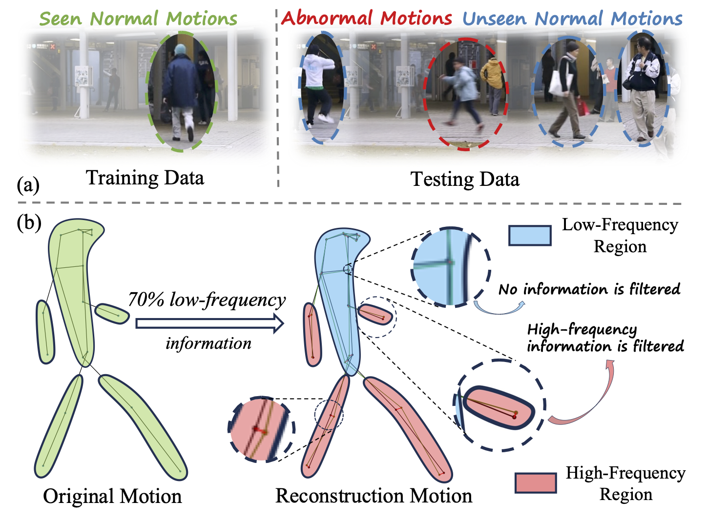

<h1 align="center"><strong>FG-Diff: Frequency-Guided Diffusion Model with Perturbation Training for Skeleton-Based Video Anomaly Detection</strong></h1>

<p align="center">
  <strong>🏆 IEEE Transactions on Image Processing (TIP), 2026</strong>
</p>

<p align="center">
  <a href='https://xiaofeng-tan.github.io/' target='_blank'>Xiaofeng Tan<sup>1,2</sup></a>&emsp;
  Hongsong Wang<sup>1,2</sup>&emsp;
  Xin Geng<sup>1,2</sup>&emsp;
  Liang Wang<sup>3,4</sup>&emsp;
  <br>
  <sup>1</sup>Southeast University&emsp;
  <sup>2</sup>Key Lab of New Generation AI Technology&emsp;
  <sup>3</sup>NLPR &amp; MAIS, Institute of Automation, CAS&emsp;
  <sup>4</sup>UCAS
</p>

<p align="center">
  
  <a href="https://arxiv.org/abs/2412.03044">
    
  </a>
  <a href="https://xiaofeng-tan.github.io/projects/FG-Diff/index.html">
    
  </a>
  <a href="https://huggingface.co/datasets/ModelsWeights/AD-FG-Diff">
    
  </a>
  <a href="https://huggingface.co/ModelsWeights/AD-FG-Diff">
    
  </a>
</p>

<p align="center">
  
  
  
</p>

---

**TL;DR:** We propose **FG-Diff**, a frequency-guided diffusion model with perturbation training that enhances model robustness through adversarial perturbation training and emphasizes principal motion components guided by motion frequencies.

<p align="center">
  
</p>

## 📣 News

- [2026/08] 🎉 Our paper has been accepted by IEEE Transactions on Image Processing (TIP)!
- [2025/12] 📖 Release technical documentation. See [Documentation (English)](docs/TECHNICAL_EN.md) | [文档 (中文)](docs/TECHNICAL_CN.md).
- [2025/12] 🎉 Release pre-trained checkpoints on [HuggingFace](https://huggingface.co/ModelsWeights/AD-FG-Diff).
- [2025/12] 📦 Release datasets on [HuggingFace](https://huggingface.co/datasets/ModelsWeights/AD-FG-Diff).
- [2024/12] 🚀 Release training and evaluation code.
- [2024/12] 📄 Paper is available on [arXiv](https://arxiv.org/abs/2412.03044).

## 📆 Plan

- [x] Release environment setup
- [x] Release training code
- [x] Release evaluation code
- [x] Release pre-trained checkpoints
- [x] Release datasets on HuggingFace
- [x] Release technical documentation

## 🗂️ Pre-trained Models

| Model | Description | Download |
|-------|-------------|----------|
| FG-Diff-Avenue | Pre-trained model on HR-Avenue | [HuggingFace](https://huggingface.co/ModelsWeights/AD-FG-Diff) |
| FG-Diff-STC | Pre-trained model on HR-ShanghaiTech | [HuggingFace](https://huggingface.co/ModelsWeights/AD-FG-Diff) |
| FG-Diff-UBnormal | Pre-trained model on UBnormal | [HuggingFace](https://huggingface.co/ModelsWeights/AD-FG-Diff) |

## 🛠️ Setup

### Environment

```bash
# Create conda environment
conda create -n FG-Diff python=3.10
conda activate FG-Diff

# Install PyTorch (CUDA 12.1)
pip install torch==2.1.2 torchvision==0.16.2 -i https://pypi.tuna.tsinghua.edu.cn/simple

# Install dependencies
pip install -r requirements.txt -i https://pypi.tuna.tsinghua.edu.cn/simple
```

<details>
<summary>🇨🇳 Configure China Mirror Sources (Optional)</summary>

```bash
# Configure pip (Tsinghua mirror)
pip config set global.index-url https://pypi.tuna.tsinghua.edu.cn/simple

# Configure conda (Tsinghua mirror)
conda config --add channels https://mirrors.tuna.tsinghua.edu.cn/anaconda/pkgs/main/
conda config --add channels https://mirrors.tuna.tsinghua.edu.cn/anaconda/pkgs/free/
conda config --add channels https://mirrors.tuna.tsinghua.edu.cn/anaconda/cloud/pytorch/
conda config --set show_channel_urls yes
```

</details>

### Datasets

Download the extracted skeleton poses from [HuggingFace](https://huggingface.co/datasets/ModelsWeights/AD-FG-Diff):

**Option 1: Using Script**
```bash
# Install huggingface_hub
pip install huggingface_hub -i https://pypi.tuna.tsinghua.edu.cn/simple

# Set HuggingFace mirror (China)
export HF_ENDPOINT=https://hf-mirror.com

# Download datasets
python scripts/download_data.py
```

**Option 2: Manual Download**

Download and organize as follows:

```
data/
├── HR-Avenue/
│   ├── training/
│   │   └── trajectories/
│   └── testing/
│       ├── trajectories/
│       └── test_frame_mask/
├── HR-ShanghaiTech/
│   ├── training/
│   │   └── trajectories/
│   └── testing/
│       ├── trajectories/
│       └── test_frame_mask/
└── UBnormal/
    ├── training/
    │   └── trajectories/
    └── testing/
        ├── trajectories/
        └── test_frame_mask/
```

### Pre-trained Models

**Option 1: Using Script**
```bash
# Set HuggingFace mirror (China)
export HF_ENDPOINT=https://hf-mirror.com

# Download checkpoints
python scripts/download_checkpoints.py
```

**Option 2: Manual Download**

Download `checkpoints.zip` from [HuggingFace](https://huggingface.co/ModelsWeights/AD-FG-Diff) and extract:
```bash
unzip checkpoints.zip
```

## 🚀 Quick Start

### Training

Key configuration parameters:

| Parameter | Type | Description |
|-----------|------|-------------|
| `perturb` | bool | Enable perturbation training |
| `weight_perturb` | float | Magnitude of input perturbation |
| `dct` | bool | Use DCT for conditioned code (if `false`, uses trainable encoder) |
| `masked_rate_dct` | float | Mask rate for DCT-based frequency masking |

```bash
# Train on HR-Avenue
python train_FG-DIFF.py --config config/Avenue/train.yaml

# Train on HR-ShanghaiTech
python train_FG-DIFF.py --config config/STC/train.yaml

# Train on UBnormal
python train_FG-DIFF.py --config config/UBnormal/train.yaml
```

### Evaluation

```bash
# Evaluate on HR-Avenue
python eval_FG-DIFF.py --config config/Avenue/test.yaml

# Evaluate on HR-ShanghaiTech
python eval_FG-DIFF.py --config config/STC/test.yaml

# Evaluate on UBnormal
python eval_FG-DIFF.py --config config/UBnormal/test.yaml

# Human-related (HR) evaluation on Avenue
python eval_FG-DIFF.py --config config/Avenue/test_hr.yaml
```

### Custom Inference

Modify the configuration file:
```yaml
split: 'test'
validation: false
load_ckpt: 'checkpoint.ckpt'
```

Then run:
```bash
python eval_FG-DIFF.py --config /path/to/your/config.yaml
```

## 🙏 Acknowledgement

This work builds upon several excellent research projects:

- [MoCoDAD](https://github.com/aleflabo/MoCoDAD) - Motion-Conditioned Diffusion Model for Skeleton-based Video Anomaly Detection

## 📝 Citation

If you find this repository helpful, please consider citing our paper:

```bibtex
@article{tan2026fgdiff,
  title={FG-Diff: Frequency-Guided Diffusion Model with Perturbation Training for Skeleton-Based Video Anomaly Detection},
  author={Tan, Xiaofeng and Wang, Hongsong and Geng, Xin and Wang, Liang},
  journal={IEEE Transactions on Image Processing},
  year={2026}
}
```

## 📜 License

This project is licensed under the MIT License - see the [LICENSE](LICENSE) file for details.

---

<p align="center">
  If you have any questions, please feel free to open an issue or contact us.
</p>
